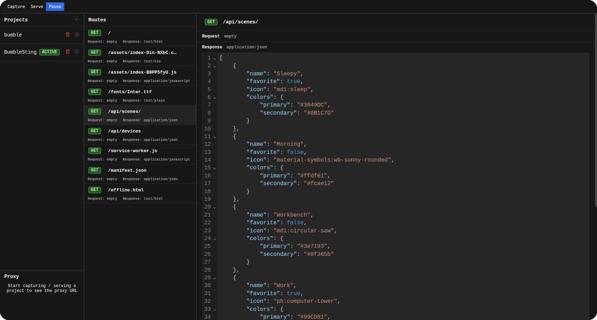

# Fånga - REST API Recorder

Record requests and responses of your private internal REST APIs and serve the captured routes later for easy public read-only demonstrations.

## Deployment

1. Install `deno`, `bun` and `npm`
2. Clone this repo: `git clone https://github.com/playlogo/Fanga.git`
3. Build frontend & docs: `./build.sh`
4. Serve backend & frontend: `cd backend/ && deno run prod`
5. Go to `http://localhost:8000`

Command line args for backend:

- `--project=<projectName>`: Automatically activate the given project
- `--serve`: Automatically serve the selected project
- `--capture`: Automatically capture for selected project

Captured REST APIs will be stores in the `backend/projects/` folder, and can be copied from on instance to another.
